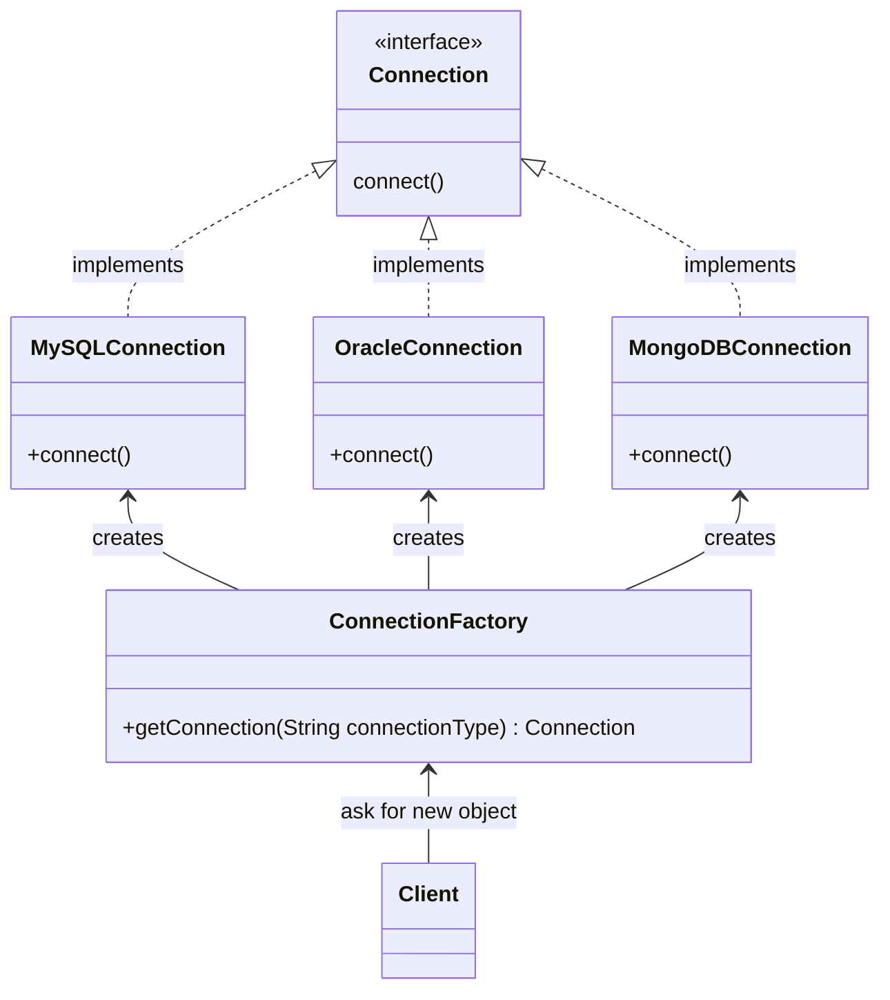
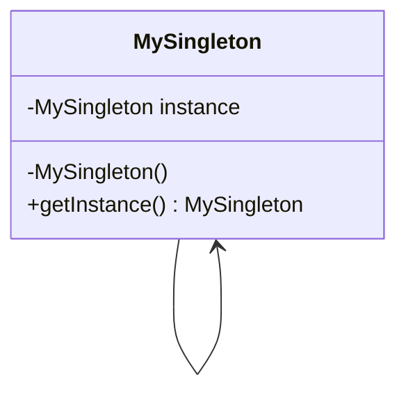

## Introduction

Creational patterns allow you to create objects while hiding the creational logic, which increase flexibility and code reusability, so you decide which objects need to be created for a particular case.

<p class="text-center">

</p>

## Factory




It allows you to create objects without exposing the creation logic to the client.

This pattern is very convenient when you have many objects of the same type and you manipulate them frequently.

### Implementation

1. Create an interface for the target objects:

    ```java
    public interface Connection {
        void connect();
    }
    ```

2. Create concrete classes implementing the interface previously created:

    ```java
    public class MySQLConnection implements Connection {
        @Override
        public void connect() {
            System.out.println("Connecting to MySQL...");
        }
    }    
    ```

    Other implementations...

3. A factory class is defined:

    ```java
    public class ConnectionFactory {

        public Connection getConnection(String connectionType) {
            switch (connectionType) {
                case "mysql":
                    return new MySQLConnection();
                case "mongodb":
                    return new MongoDBConnection();
                case "oracle":
                    return new OracleConnection();
                default:
                    return null;
            }
        }
    }
    ```

4. The factory class is used by the client to create a concrete class given a name:

    ```java
    public class Client {

        public static void main(String[] args) {

            ConnectionFactory connectionFactory = new ConnectionFactory();
            Connection mysqlConnection = connectionFactory.getConnection("mysql");

            if (mysqlConnection != null) {
                mysqlConnection.connect();
            } else {
                System.out.println("Please, provide a valid DB type");
            }
        }
    }
    ```

## Abstract Factory

This pattern is a factory of factories and it allows you to create related objects without explicitly specifying their classes.

This pattern is very convenient when you have many objects of the same family and you manipulate them frequently.

### Implementation

1. Create an interface for the target objects:

    ```java
    public interface Connection {
        void connect();
    }
    ```

2. Create concrete classes implementing the interface previously created:

    ```java
    public class MySQLAWSConnection implements Connection {
        @Override
        public void connect() {
            System.out.println("Connecting to MySQL...");
        }
    }    
    ```

    ...

3. Create an interface to get factories of different family of objects:

    ```java
    public interface ConnectionAbstractFactory {
        Connection getConnection(String connectionType);
    }
    ```

4. Create factory classes extending the abstract factory class to generate object of concrete class given a name.

    ```java
    public class AWSConnectionFactory implements ConnectionAbstractFactory {
        @Override
        public Connection getConnection(String connectionType) {
            switch (connectionType) {
                case "mysql":
                    return new MySQLAWSConnection();
                case "mongodb":
                    return new MongoDBAWSConnection();
                case "oracle":
                    return new OracleAWSConnection();
                default:
                    return null;
            }
        }
    }
    ```

    ```java
    public class ConnectionFactory implements ConnectionAbstractFactory {
        @Override
        public Connection getConnection(String connectionType) {
            switch (connectionType) {
                case "mysql":
                    return new MySQLConnection();
                case "mongodb":
                    return new MongoDBConnection();
                case "oracle":
                    return new OracleConnection();
                default:
                    return null;
            }
        }
    }    
    ```

5. Use the `FactoryCreator` to get the abstract factory class in order to get factories of concrete classes by passing names.

    ```java
    public class Client {

        public static void main(String[] args) {

            ConnectionAbstractFactory awsConnectionFactory = FactoryCreator.getConnectionFactory(true);
            Connection mysqlAwsConnection = awsConnectionFactory.getConnection("mysql");

            if (mysqlAwsConnection != null) {
                mysqlAwsConnection.connect();
            } else {
                System.out.println("Please, provide a valid DB type");
            }

            ConnectionAbstractFactory regularConnectionFactory = FactoryCreator.getConnectionFactory(false);
            Connection mysqlRegularConnection = regularConnectionFactory.getConnection("mysql");

            if (mysqlRegularConnection != null) {
                mysqlRegularConnection.connect();
            } else {
                System.out.println("Please, provide a valid DB type");
            }
        }
    }
    ```

## Singleton

It allows you to create a single instance of a class for the entire lifespan of your application, so you can make sure that a particular class is created only once.

It's frequently used for logging classes, because a logging object usually needs to be used over and over again by many classes in the same application.

Singleton is a powerful pattern, but use it only when it is strictly necessary.

- Singleton clients will be **harder to test** since it is not possible to substitute a mock implementation for a singleton class.
- This pattern may behave as an **anti-pattern**, because it introduces global variables in your application.
- Singletons are bad when implemented with **multi-threading**.

### Implementation




**Singleton class implementations:**

- **Eager initialization with private constructor and declaring a public final field**
- **Eager initialization with private constructor and creating a static factory method**
- **Lazy initialization and Double Check Locking pattern**
- **Declare a single** `Enum` **field**

#### Singleton With Immutable Public Field

1. Create singleton class:

    ```java
    public class MySingleton {

        public static final MySingleton instance = new MySingleton();

        private int value;

        private MySingleton() {

        }

        public void setValue(int value) {
            this.value = value;
        }

        public int getValue() {
            return value;
        }
    }
    ```

2. The client can get the object from the singleton class:

    ```java
    MySingleton instance = SingletonWithPublicFinalField.instance;

    instance.setValue(100);
    System.out.println(instance.getValue());
    ```

**Considerations**: The constructor can be invoked reflectively. Therefore, there are ways to create more than one instantiation of the class.

```java
// reflection concept to get constructor of a Singleton class.
Constructor<MySingleton> constructor = MySingleton.class.getDeclaredConstructor();
// change the accessibility of constructor for outside a class object creation.
constructor.setAccessible(true);

// creates first object of a class as constructor is accessible now.
MySingleton firstSingleton = constructor.newInstance();
firstSingleton.setValue(5);

// creates second object of a class as constructor is accessible now.
MySingleton secondSingleton = constructor.newInstance();
secondSingleton.setValue(10);
System.out.println(secondSingleton.getValue()); // value = 10
System.out.println(firstSingleton.getValue()); // value = 5

constructor.setAccessible(false);
```

#### Singleton With Factory Method

1. Create singleton class:

    ```java
    public class MySingleton {

        private static MySingleton instance = new MySingleton();

        private int value;

        private MySingleton() {

        }

        public static MySingleton getInstance(){
            return instance;
        }

        public void setValue(int value) {
            this.value = value;
        }

        public int getValue() {
            return value;
        }
    }
    ```

2. The client can get the object from the singleton class:

    ```java
    MySingleton mySingleton = SingletonWithFactoryMethod.getInstance();

    mySingleton.setValue(200);
    System.out.println(mySingleton.getValue());
    ```

**Advantages**:

- It is **more flexible.**
- It allows you to **create a generic singleton factory**.
- It is a supplier and allows you to call it as `MySingleton::getInstance`.

**Disadvantages**:

- Constructor can be invoked reflectively.
- If you are not going to take advantage of any of the previous points, it is recommended to use the first option.

#### Singleton With Lazy Initialization And Double Check Locking Pattern

This is similar to the previous singleton creation and it is only adding **thread safety** by using **Double-Checked Locking Pattern**.

1. Create singleton class:

    ```java
    public class MySingleton {
        private static volatile MySingleton instance;

        private MySingleton() {

        }

        public static MySingleton getInstance() {
            if (instance == null) { // 1st check

                synchronized (MySingleton.class) {

                    if (instance == null) { // 2nd check
                        instance = new MySingleton();
                    }
                }
            }
            return instance;
        }
    }
    ```

2. The client can get the object from the singleton class:

    ```java
    MySingleton mySingleton= LazyInitializationAndDoubleCheckLocking.getInstance();

    mySingleton.setValue(300);
    System.out.println(mySingleton.getValue());
    ```

##### Double-Checked Locking Pattern

- A **_static volatile_** field is created to hold the instance. The variable is stored in the main memory, so reading or writing to the volatile variable will be on the main memory and not only on the CPU cache. This ensures that the singleton will never be half initialized.
- The first check is not synchronized to improve performance and enable reordering of **_JVM_**.
- The second _synchronized_ check is executed only once during the lifespan of the singleton. By doing this you get a performance boost because locking only happens once.

#### Singleton With Enum

This is the preferred way.

1. Create singleton class:

    ```java
    public enum MySingleton {

        INSTANCE;

        private int value;

        public int getValue() {
            return value;
        }

        public void setValue(int value) {
            this.value = value;
        }
    }
    ```

2. The client can get the object from the singleton enum:

    ```java
    MySingleton mySingleton = EnumSingleton.INSTANCE;

    mySingleton.setValue(400);
    System.out.println(mySingleton.getValue());
    ```

**Advantages**:

- **Protection against reflection**.
- Provides **Serialization**. There is no way to create more than one instance of this type of singleton.
- **Thread-safe** out-of-the-box.
- **More simple**.

**Disadvantages**:

- Your singleton **only can extend a Enum** superclass

### Builder

// TODO

### Prototype

// TODO
