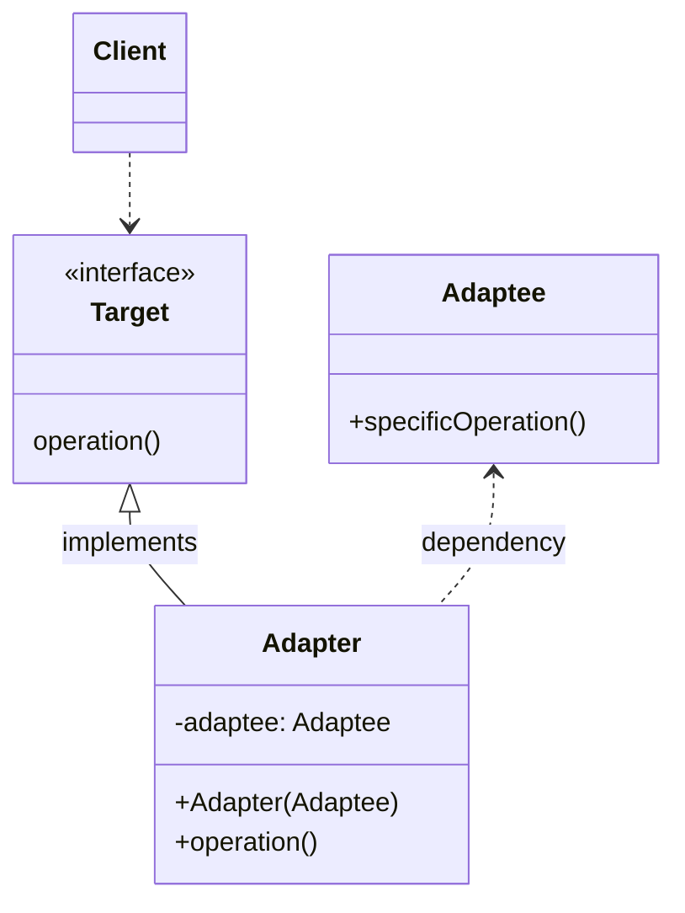

## Introduction

These patters are about providing different ways to create a class structure with inheritance and composition.

<p class="text-center">

</p>

## Adapter

**Adapter** pattern wraps a interface in another interface that is required by the client, so it works as a bridge between to classes.

It is usually used when a specific interface is required by the client. This pattern can be applied when the target interface and the one required by the client are very similar.

The adapter class should do only the necessary to adapt the original class, so no additional logic should be added to the adapter.

### Implementation



1. Create _adapter_ interface used by the client:

    ```java
    public interface FullNameConverter {
        String toUpperCase(String firstName, String lastName);
    }
    ```

2. Create _adapter_ class implementing the _adapter_ interface and adding a constructor with the _adaptee_:

    ```java
    public class FullNameConverterAdapter implements FullNameConverter {

        private ExistingFullNameConverter existingFullNameConverter;

        public FullNameConverterAdapter(ExistingFullNameConverter existingFullNameConverter) {
            this.existingFullNameConverter = existingFullNameConverter;
        }

        @Override
        public String toUpperCase(String firstName, String lastName) {
            return existingFullNameConverter.toUpperCase(firstName + " " + lastName);
        }
    }
    ```

3. The client will create an instance of the _adapter_ class and inject the _adaptee_:

    ```java
    FullNameConverter fullNameConverter = new FullNameConverterAdapter(new ExistingFullNameConverter());

    System.out.println(fullNameConverter.toUpperCase("Sergio" , "Martin"));
    ```


## Proxy

**Proxy** pattern encapsulates an object to control references to it, so you can control the access to resources.

One of the use cases is when the object creation involves a heavy computation task, like calculation prime numbers. This pattern will allow you to lazily perform the computation only when the data is needed.

The Proxy pattern hides the behavior of the original class. Therefore, the risk of using this pattern is that you might not be aware of what is happening under the hood.

### Implementation



1. Create interface for _proxy_ class and original class:

    ```java
    public interface PrimesCalculator {
        long getNumberOfPrimes();
    }
    ```

2. Create original class and _proxy_ class implementing the same interface:

    ```java
    public class OriginalPrimesCalculator implements PrimesCalculator {

        private List<Long> primes;

        public OriginalPrimesCalculator(long n) {
            this.primes = LongStream.rangeClosed(2, n)
                    .filter(x -> isPrime(x))
                    .boxed()
                    .collect(Collectors.toList());
        }

        @Override
        public long getPrimesCount() {
            return primes.size();
        }

        private boolean isPrime(long number) {
            return LongStream.rangeClosed(2,  (long) Math.sqrt(number))
                    .allMatch(x -> number % x != 0);
        }
    }
    ```

    ```java
    public class ProxyPrimeCalculator implements PrimesCalculator {
        private OriginalPrimesCalculator originalPrimesCalculator = null;
        private long number;

        public ProxyPrimeCalculator(long number) {
            this.number = number;
        }
        
        @Override
        public long getPrimesCount() {
            if (this.originalPrimesCalculator == null) {
                this.originalPrimesCalculator = new OriginalPrimesCalculator(this.number);
            }
            return this.originalPrimesCalculator.getPrimesCount();
        }
    }
    ```

3. Use the proxy class in the client:

    ```java
    PrimesCalculator calculator = new ProxyPrimeCalculator(NUMBER);
    System.out.println("Proxy created!");

    long nPrimes = calculator.getPrimesCount();
    System.out.println("Number of Primes in " + NUMBER + " is " + nPrimes);
    ```

## Decorator

**Decorator** pattern allows you to add additional functionality to an existing object without altering its structure.

This pattern is a great alternative to subclassing, because instead of using inheritance to provide new functionalities it uses composition to avoid producing an explosion of subclasses.

Keep in mind that many decorators can be hard to maintain and debug since the behavior of the object changes at runtime.

### Implementation




1. Create an interface for the parent _decorator_ classes:

    ```java
    public interface Password {
        String getPassword(String value);
    }
    ```

2. Create concrete classes implementing the interface:

    ```java
    public class PlainTextPassword implements Password {
        @Override
        public String getPassword(String value) {
            return value;
        }
    }
    ```

3. Create a parent _decorator_ class implementing the interface:

    ```java
    public class HashDecorator implements Password {

        private Password password;

        public HashDecorator(Password password) {
            this.password = password;
        }

        @Override
        public String getPassword(String value) {
            return password.getPassword(value);
        }
    }
    ```

4. Create concrete _decorator_ classes extending the parent _decorator_ class.

    ```java
    public class MD5Decorator extends HashDecorator {

        public MD5Decorator(Password password) {
            super(password);
        }

        @Override
        public String getPassword(String value) throws NoSuchAlgorithmException {
            MessageDigest messageDigest = MessageDigest.getInstance("MD5");
            messageDigest.update(value.getBytes());
            byte[] digest = messageDigest.digest();
            return super.getPassword(DatatypeConverter.printHexBinary(digest));
        }
    }
    ```

    ...

5. Use specific decorators to decorate objects.

    ```java
    Password password1 = new MD5Decorator(new PlainTextPassword());
    Password password2 = new SHA1Decorator(new PlainTextPassword());
    Password password3 = new BCryptDecorator(new PlainTextPassword());
    Password password4 = new MD5Decorator(new BCryptDecorator(new PlainTextPassword()));
    Password password5 = new SHA1Decorator(new MD5Decorator(new BCryptDecorator(new PlainTextPassword())));

    String hash1 = password1.getPassword("password");
    String hash2 = password2.getPassword("password");
    String hash3 = password3.getPassword("password");
    String hash4 = password4.getPassword("password");
    String hash5 = password5.getPassword("password");

    System.out.println("MD5: " + hash1);
    System.out.println("SHA-1: " + hash2);
    System.out.println("BCrypt: " + hash3);
    System.out.println("BCrypt of MD5: " + hash4);
    System.out.println("BCrypt of MD5 of SH1: " + hash5);
    ```

## Bridge

**Bridge** pattern decouples abstraction from its implementation and avoids class explosion. This pattern give you the freedom of developing abstraction and implementation independently and create multiple combinations. The client only has access to the abstraction and does not need to know anything about the implementation.

On the other hand, Bridge pattern increases complexity due to the fact that it uses composition over inheritance

### Implementation




1. Create _bridge_ implementer interface:

    ```java
    public interface Difficulty {
        void play();
    }
    ```

2. Create concrete _bridge_ implementer classes implementing the previous interface:

    ```java
    public class Easy implements Difficulty {
        @Override
        public void play() {
            System.out.println("EASY mode enabled");
        }
    }
    ```

    ...

3. Create an abstract class that uses the interface:

    ```java
    public abstract class Game {
        protected Difficulty difficulty;

        protected Game(Difficulty difficulty) {
            this.difficulty = difficulty;
        }

        public abstract void run();
    }
    ```

4. Create concrete classes that inherit from the abstract class:

    ```java
    public class Pong extends Game {

        public Pong(Difficulty difficulty) {
            super(difficulty);
        }

        @Override
        public void run() {
            difficulty.play();
        }
    }
    ```

5. Use the implementation and abstraction classes on the client:

    ```java
    Game minesweeper = new MinesSweeper(new Easy());
    minesweeper.run();

    Game pong = new Pong(new Hard());
    pong.run();

    Game arkanoid = new Arkanoid(new Medium());
    arkanoid.run();
    ```

## Facade

Facade pattern provides a unified interface to a set of interfaces in a subsystem and is used to wraps complex systems. It provides a higher level interface that interacts with a complex subsystem.

### Implementation

1. Create an interface for the behaviors or actions:

    ```java
    public interface Action {
        void doAction(UUID orderId);
    }
    ```

2. Create concrete classes of each action implementing the previous interface:

    ```java
    public class OrderCreation implements Action {

        @Override
        public void doAction(UUID orderId) {
            System.out.println("Creating order " + orderId + " on the system.");
        }
    }
    ```

    ```java
    public class OrderPriceCalculator implements Action {

        @Override
        public void doAction(UUID orderId) {
            System.out.println("Calculation price for order " + orderId);
        }
    }   
    ```

    ```java
    public class OrderProcessor implements Action {

        @Override
        public void doAction(UUID orderId) {
            System.out.println("Processing order " + orderId);
        }
    }
    ```

3. Create _facade_ class which encapsulates the different actions:

    ```java
    public class OrderFacade {

        private OrderCreation orderCreation;
        private OrderPriceCalculator orderPriceCalculator;
        private OrderProcessor orderProcessor;

        public OrderFacade() {
            this.orderCreation = new OrderCreation();
            this.orderPriceCalculator = new OrderPriceCalculator();
            this.orderProcessor = new OrderProcessor();
        }

        public void createOrder(UUID orderId) {
            orderCreation.doAction(orderId);
        }

        public void calculateOrderPrice(UUID orderId) {
            orderPriceCalculator.doAction(orderId);
        }

        public void processOrder(UUID orderId) {
            orderProcessor.doAction(orderId);
        }
    }
    ```

4. Use the _facade_ to execute actions:

    ```java
    OrderFacade orderFacade = new OrderFacade();

    orderFacade.createOrder(ORDER_ID);
    orderFacade.calculateOrderPrice(ORDER_ID);
    orderFacade.processOrder(ORDER_ID);
    ```
