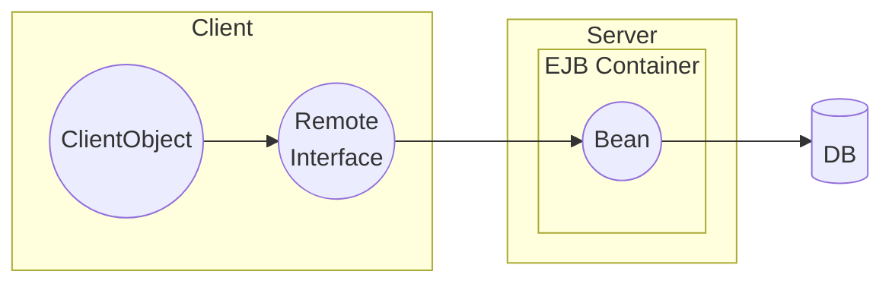
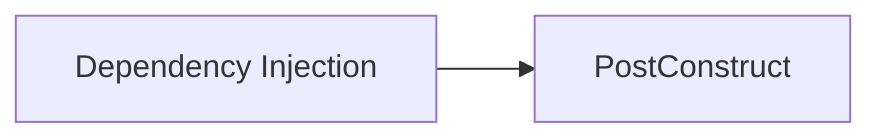
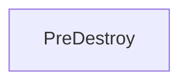
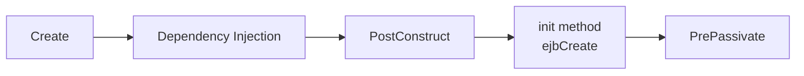

## Introduction

**EJB** (*Enterprise Java Beans*) is part of the Java EE (previously called *J2EE* and *Jakarta EE* since 2018) specification and allows you to modularize your application by enabling component-based development. You can reuse and package EJBs into multiple application. EJB components always live in an EJB container that orchestrates underlying services, so you don't have to worry about writing the logic for services such as persistence, transactions, networking, security... and you can focus on the business logic.



## EJB Types

There are three EJB object types:

- **Session beans:** perform business service operations. 
- [**Entities**](https://sergiomartinrubio.com/articles/jpa-introduction-to-java-persistence-api): are used to identify and represent persistent structures. They usually represent a row in a table or columns from multiple tables. Since EJB 3, entities are now managed by a persistence provider instead of the EJB container, so they are not considered enterprise beans anymore.
- [**Message-driver beans**](https://sergiomartinrubio.com/articles/introduction-to-message-driven-beans) (*MDBs*): are beans used by JMS to listen to new asynchronous messages.

## Session Beans

Session beans implement the business logic. EJB containers manage the session beans and provide services such as security, transactions, persistence...

### Session Bean Types

- **Stateless**: A stateless bean **does not maintain any state** of the interaction between the bean and the client. When the method execution completes the state is removed. e.g. search for an item
- **Stateful**: A stateful session bean **maintains the state** of the interaction between the bean the client. An instance of the bean is associated with a particular client request. e.g. keep a shopping basket
- **Singleton**: A singleton bean is **instantiate only once per application**. It maintains the state between client calls. e.g. keep a counter.

### Session Bean Lifecycle Methods

*EJB* provides lifecycle callback methods to run business logic at a particular stage of the bean lifecycle.

| Method           | Stateless | Stateful | Singleton |
| ---------------- | :-------: | :------: | :-------: |
| `@PostConstruct` |     ✅     |    ✅     |     ✅     |
| `@PrePassivate`  |     ❌     |    ✅     |     ❌     |
| `@PostActivate`  |     ❌     |    ✅     |     ❌     |
| `@Remove`        |     ❌     |    ✅     |     ❌     |
| `@PreDestroy`    |     ✅     |    ✅     |     ✅     |

- `@PostConstruct`: is triggered after the bean is instantiated in the EJB container.

```java
@PostConstruct
public void postConstruct() {
    // initialize something
}
```

- `@PreDestory`: is triggered just before the container destroys the bean instance.

```java
@PreDestroy
public void preDestroy() {
    // clean up, close DB connections...
}
```

### Stateless Session Bean

A stateless session bean is a Java class annotated with `@Stateless` (alternatively you can use a deployment descriptors, `ebb-jar.xml`. Deployment descriptors take precedence over annotations).

```java
@Stateless
public class StatelessBean {
}
```

The EJB container has a pool of stateless session beans.

Lifecycle:





### Stateful Session Bean

A stateful session bean is a Java class annotated with `@Stateful`.

```java
@Stateful
public class StatefulBean {
}
```

Lifecycle:




Stateful session beans provide transaction annotations that can be used to run business logic at a particular time of the transaction process. Three types:

- `@AfterBegin`: a transaction starts
- `@BeforeCompletion`: a transaction is going to be committed
- `@AfterCompletion`: a transaction is completed

### Singleton Session Bean

A stateful session bean is a Java class annotated with `@Singleton`.

```java
@Singleton
@Startup
public class SingletonBean {
}
```

The lifecycle of a singleton bean is the same as the stateless bean one.

You can annotate a singleton bean with `@Startup` to indicate that the container must initialize the singleton bean during the application startup. This can be useful when another bean requires that a particular bean is already initialized.

```java
@Singleton
@Startup
@DependsOn("SearchCountBean")
public class LogCounterBean {
}
```

Singleton bean can be shared by multiple clients, therefore, support of concurrent access is very important. You have two choices to handle concurrency:

- **Container-managed concurrency** (default): the container controls the concurrent access.
- **Bean-managed concurrency**: the container allows full access to the singleton bean, so you are responsible for handling synchronisation.

You can specify the type of concurrency with `@ConcurrencyManagement` (`CONTAINER` or `BEAN`).

```java
@Singleton
@Startup
@ConcurrencyManagement(ConcurrencyManagementType.CONTAINER)
public class SingletonBean {
}
```

When using the container-managed concurrency model you can use `@Lock` annotation to enable synchronisation at class level or business level for read access or write access.

```java
@Lock(LockType.WRITE)
public void increaseCounter() {
    counter++;
}

@Lock(LockType.READ)
public int getCounter() {
    return counter;
}
```

### Session Bean Access

*EJB* clients can access enterprise bean through a **no-interface** view or through **a business interface**. A *no-interface* view is the actual java class that exposes the methods to be used by the clients, whereas, a *business interface* is an interface implemented by the bean that contains a set of methods that will be available for the client.

There are two types of clients, **local** and **remote**.

#### Local View

- They run in the same application as the EJB and can be used by a web component or another bean. 
- They can use a **no-interface view** or a **local business interface**.

The local business interface can be declared in two different ways:

- Place `@Local` annotation in the interface.

```java
@Local
public interface StatefulLocal {
    void addNumber(Integer number);
    void removeNumber(Integer number);
    List<Integer> getNumbers();
}
```

```java
@Stateful
public class StatefulBean implements StatefulLocal {
    // implementations
}
```

- Place `@Local` annotation in the bean.

```java
public interface StatefulLocal {
    void addNumber(Integer number);
    void removeNumber(Integer number);
    List<Integer> getNumbers();
}
```

```java
@Stateful
@Local(StatefulLocal.class)
public class StatefulBean implements StatefulLocal {
   // implementations
}
```

In both cases the bean implements the business interface.

On the other hand, you can create no-interface views by not creating any interface or adding extra annotations. In case you want to have a combination of remote view  and local view with no interface you can use `@LocalBean` (available since EJB 3.1).

```java
@Remote
public interface StatefulRemote {
    void addNumber(Integer number);
}
```

```java
@Stateful
@LocalBean
public class StatefulBean implements StatefulRemote {
    @Override
    public void addNumber(Integer number) {
    }

    public void removeNumber(Integer number) {
    }

    public List<Integer> getNumbers() {
    }
}
```

In the previous example if we don't use `@LocalBean` we would have to create an additional interface for the no-interface local view.

#### Remote View

- The clients can be located in a different machine or a different *JVM*. 
- Remote clients can be a web component, an application client or another bean. 
- Remote beans must implement a **business interface**, otherwise the clients won't have access to it.

In the same way as **local business interface** you can define remote views with `@Remote`.

### Session Bean Naming Convections

| Component             | Convection |
| --------------------- | ---------- |
| Enterprise bean name  | `nameBean` |
| Enterprise bean class | `nameBean` |
| Business interface    | `name`     |

Classes with prefix `Bean` won't be included in the client `.jar` file generated by the Maven plugin `maven-ejb-plugin`.

### Session Bean Interceptor

Interceptors are another type of annotation that can be added to your enterprise bean and they allow you to run some business logic before and after running the methods.

```java
@AroundInvoke
public Object logMethodInvocationTime(InvocationContext ctx) throws Exception {
    long startTime = System.currentTimeMillis();
    LOGGER.log(Level.INFO, "Running method " + ctx.getMethod());

    try {
     	  return ctx.proceed();
    } finally {
      	long totalTime = System.currentTimeMillis() - startTime;
      	LOGGER.log(Level.INFO, "Method" + ctx.getMethod() + " takes " + totalTime + "ms to run!");
    }
}
```

### Session Bean Timer Service

The Timer Service adds support to create cron jobs in your application. You can schedule actions to happen at a particular time. Use `@Schedule` with metadata parameters to crate timers.

```java
// Logs search count every 10 seconds
@Schedule(hour = "*", minute = "*", second = "*/10")
public void logCounter(Timer timer) {
    String timerInfo = (String) timer.getInfo();
    LOGGER.log(Level.INFO, "Counter: " + singletonLocal.getCounter() + " - " + timerInfo);
}
```

You can persist timer (`persistent = true`) by storing it in a database.

### Session Bean Clients

Clients can retrieve session beans via **dependency injection** or [JNDI lookup](https://sergiomartinrubio.com/articles/jndi-overview). In case of stateless session beans a new instance is retrieved on every invocation, whereas in stateful session beans, the instance is cached on the client side so the container can return always the same instance to the client.dependency

> Depending on the JEE server provider you choose you might have different functionalities enabled. For instance, `wildfly-20.0.1` has not implemented `@EJB` annotation yet, so you must use JNDI to call a remote component.

Assuming you are also using [Glassfish](https://www.oracle.com/middleware/technologies/glassfish-server.html){:target="_blank"} as the JEE server provider you should be able to use dependency injection in the client. If you are using [WildFly](https://www.wildfly.org/){:target="_blank"} you have to use JNDI lookup.

To use the *EJB* client interfaces in your ejb server you will have to add a plugin that generates the client:

```xml
<build>
    <pluginManagement>
        <plugins>
            <plugin>
                <groupId>org.apache.maven.plugins</groupId>
                <artifactId>maven-ejb-plugin</artifactId>
                <version>3.1.0</version>
                <configuration>
                    <ejbVersion>3.2</ejbVersion>
                    <generateClient>true</generateClient>
                </configuration>
            </plugin>
        </plugins>
    </pluginManagement>
</build>
```

Then in the client application you can add the client dependency generated by the *ejb* server:

```xml
<!-- We depend on the EJB remote business interfaces of this application -->
<dependency>
    <groupId>com.sergiomartinrubio.ejb.javaee8</groupId>
    <artifactId>ejb-beans</artifactId>
    <version>1.3</version>
    <type>ejb-client</type>
</dependency>
```

Now you can inject the beans with `@EJB`:

```java
@WebServlet(urlPatterns = "/stateful")
public class StatefulBeanClient extends HttpServlet {

    // use dependency injection access the remote business
    // interface of an enterprise bean
//    @EJB(lookup = "java:global/ejb-beans-1.3/StatefulBean!com.sergiomartinrubio.ejb.javaee8.stateful.StatefulRemote")
    @EJB
    private StatefulRemote statefulBean;

    @EJB
    private SingletonRemote singletonRemote;

    protected void processRequest(HttpServletRequest request, HttpServletResponse response) throws IOException {
        try (PrintWriter out = response.getWriter()) {
            out.println("Adding Number...");
            statefulBean.addNumber(29);
            singletonRemote.increaseCounter();
            List<Integer> numbers = statefulBean.getNumbers();
            for (Integer number : numbers) {
                out.println(number);
            }
        }
    }

    @Override
    protected void doGet(HttpServletRequest request, HttpServletResponse response) throws IOException {
        processRequest(request, response);
    }

    @Override
    protected void doPost(HttpServletRequest request, HttpServletResponse response) throws IOException {
        processRequest(request, response);
    }

    @Override
    public String getServletInfo() {
        return "Stateful Bean servlet";
    }
}
```

<p class="text-center">

</p>
