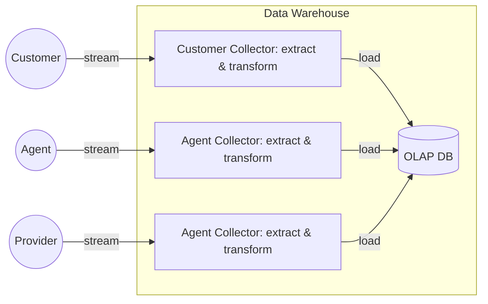

## Introduction

Data can be store in two different ways depending on the business goal. Most of the companies use an **OLTP** (*On-Line Transaction Processing*) database to store end user data that requires high performance, however some companies that analyze petabytes of data internally require an alternative database called **OLAP** (*On-Line Analytical Processing*).

## OLTP

**OLTP** databases are used to store records that come straight from the end users and they are expected to be high available and to process transactions with low latency since they are critical for running the business.

Business analysts are not suppose to use OLTP databases to avoid impacting the performance when querying a huge number of records.

## OLAP

Databases are also used for analytics and here is where **OLAP** databases are useful because business analysts have different query patterns. Usually an analytic queries a huge number of records and particular columns to generate  metrics such as total amount of sales, the average amount spent... rather than returning specific records from the database.

The query requirements usually come from business analysts and they use the data to create reports and make better decisions.

OLAP databases usually belong to a **data warehouse** team. The data warehouse is responsible for aggregating data from different OLTP systems in the company and stores a read-only copy of the aggregated data. The data is consume in the data warehouse as a stream of events or using a periodic data dump.

> A **data warehouse** is a system used for aggregating data from different OLTP systems, creating reports and  analyzing that data. It is one of the key pieces of business intelligence.

The process of extracting the data from OLTP, do some transformation and storing the data in OLAP is called **ETL** (*Extract-Transform-Load*). 

OLAP databases usually use a relational model and SQL is the preferred query language, however things are quite different behind the scenes in comparison with a OLTP database.

OLAP databases use a **star schema** (also called *dimensional modeling*) or a **snowflake schema**. A star schema structure consist of a **fact table** a **dimension tables**. 

A fact table **stores individual events** with the following information:

- **Measures**: numeric data like sales transactions for a particular product.
- **Dimension keys**: foreign key references to dimension tables.

An **snowflake schema** is an evolution of a star schema where dimensions are further broken down into sub-dimensions.

**Materialized views** is one of the features of OLAP databases and allows you to precompute certain queries so that they become very fast. However, one of the disadvantages of having materialized views is that they are not very flexible.

Some of the most popular OLAP providers are [Apache Hive](https://hive.apache.org){:target="_blank"}, [Spark SQL](https://spark.apache.org/docs/latest/index.html){:target="_blank"} or even [BigQuery](https://cloud.google.com/bigquery){:target="_blank"}.

## OLTP vs OLAP

| OLTP                     | OLAP                          |
| ------------------------ | ----------------------------- |
| Generated by end users   | Streamed by other systems     |
| Queried by index         | Queried in bulk               |
| Consumed by end users    | Consumed by business analysts |
| Performance in important | Performance is not important  |

One of the advantages of OLAP over OLTP is that queries can be optimized for analytic access patterns