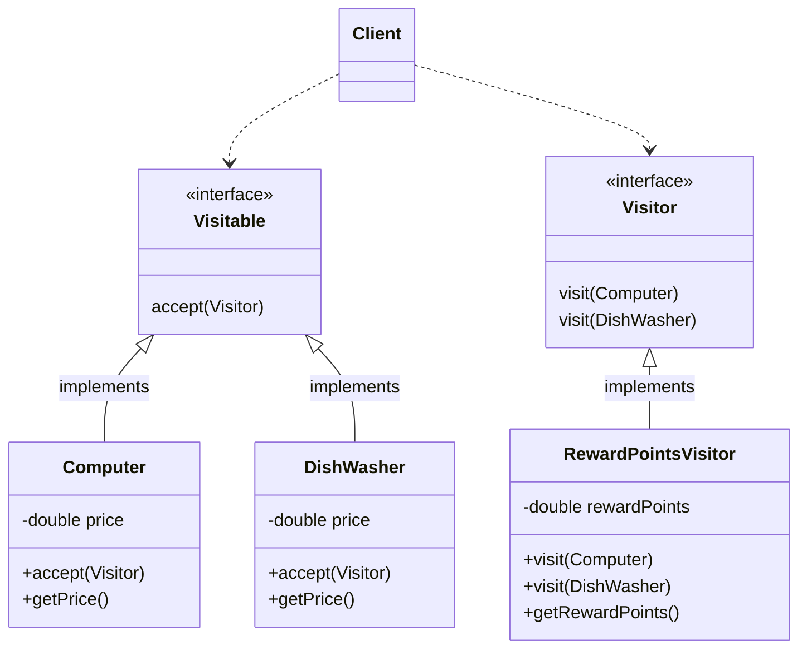

Behavioral patterns improve communication and flexibility between objects.

<p class="text-center">

</p>

## Observer

The <u>observer</u> pattern establishes a one to many relationship, so if an observable object is modified, all the observers listening to changes on that object get notified.

This pattern **is used to reflect changes in an object when there are changes in another object**, without having these two objects coupled. The observer pattern allows you to add additional observers in the future with minimal changes.

It's important to highlight that if we have many observers and observables, the communication between them can become complex.

An Observable object needs to be created and then, the observers subscribe to the observable. Each time the observable state changes, attached observers are notified .

### Implementation



1. Create an _observer_ interface:

    ```java
    public interface Observer {
        void update();
    }
    ```

2. Create a _subject_ interface:

    ```java
    public interface Subject {
        void register(Observer obj);
        void unregister(Observer obj);
        void notifyObservers();
    }
    ```

3. Create a class implementing the `Subject` interface. This class will be responsible for registering, unregistering and notifying _observers_:

    ```java
    public class MessageNotifier implements Subject, Runnable {

        private List<Observer> observers;

        private String message;

        public MessageNotifier() {
            observers = new ArrayList<>();
        }

        @Override
        public void register(Observer observer) {
            observers.add(observer);
        }

        @Override
        public void unregister(Observer observer) {
            observers.remove(observer);
        }

        @Override
        public void notifyObservers() {
            for (Observer observer : observers) {
                observer.update();
            }
        }

        public String showMessage() {
            return this.message;
        }

        public void setMessage(String message) {
            this.message = message;
        }

        @Override
        public void run() {
            Scanner sc =  new Scanner(System.in);
            while (true) {
                String response = sc.next();
                setMessage(response);
                notifyObservers();
            }

        }
    }
    ```

4. Create concrete classes for _observers_ implementing the `Observer` interface. The class implementing the _subject_ interface is included by composition, so it has access to the updates:

    ```java
    public class Mobile implements Observer {

        private MessageNotifier messageNotifier;

        public Mobile(MessageNotifier messageNotifier) {
            this.messageNotifier = messageNotifier;
        }

        @Override
        public void update() {
            System.out.println(messageNotifier.showMessage() + " from Mobile");
        }
    }
    ```

5. The client is responsible for creating the _subject_ class and registering the _observers_:

    ```java
    System.out.println("Enter message: ");
    MessageNotifier messageNotifier =  new MessageNotifier();
    Mobile observerOne = new Mobile(messageNotifier);
    Desktop observerTwo = new Desktop(messageNotifier);
    Tablet observerThree = new Tablet(messageNotifier);
    messageNotifier.register(observerOne);
    messageNotifier.register(observerTwo);
    messageNotifier.register(observerThree);
    
    new Thread(messageNotifier).start();
    ```

## Command

The <u>command</u> pattern is a data driven design pattern that allows you to create a set of behaviors for a particular subject. It decouples the object that invokes the action from the object that performs the action.

It is used to queue commands and keep a history of them to do and undo actions. 

### Implementation

1. Create a _command_ interface:

    ```java
    public interface Command {
        void execute(UUID policyId);
    }
    ```

2. Create a _request_ class:

    ```java
    public class Policy {

        public void create(UUID policyId) {
            System.out.println("Create policy " + policyId);
        }

        public void update(UUID policyId) {
            System.out.println("Update policy " + policyId);
        }

        public void cancel(UUID policyId) {
            System.out.println("Cancel policy " + policyId);
        }
    }
    ```

3. Create concrete classes implementing the `Command` interface:

    ```java
    public class CreatePolicy implements Command {

        private Policy policy;

        public CreatePolicy(Policy policy) {
            this.policy = policy;
        }

        @Override
        public void execute(UUID policyId) {
            policy.create(policyId);
        }
    }
    ```

    ...

4. Create a _command_ _invoker_ class:

    ```java
    public class PolicyCommandsInvoker {

        private List<Command> commands = new ArrayList<>();

        public void takeCommand(Command command) {
            commands.add(command);
        }

        public void runCommands(UUID policyId) {
            for (Command command : commands) {
                command.execute(policyId);
            }
        }
    }
    ```

5. The client can use the _invoker_ class to execute commands:

    ```java
    Policy policy = new Policy();
    
    CreatePolicy createPolicy = new CreatePolicy(policy);
    UpdatePolicy updatePolicy = new UpdatePolicy(policy);
    CancelPolicy cancelPolicy = new CancelPolicy(policy);
    
    PolicyCommandsInvoker policyCommandsInvoker = new PolicyCommandsInvoker();
    policyCommandsInvoker.takeCommand(createPolicy);
    policyCommandsInvoker.takeCommand(updatePolicy);
    policyCommandsInvoker.takeCommand(cancelPolicy);
    
    policyCommandsInvoker.runCommands(UUID.randomUUID());
    ```

## Strategy

The <u>strategy</u> pattern defines a family of behaviors which are interchangeable. This pattern allows you to change at runtime the way an object behaves. Therefore, instead of having multiple instances, there will be only one that is able to interchange different behaviors, and the only requirement for these strategies or behaviors is having a common interface required by the context object. 

### Implementation



1. Create _strategy_ interface:

    ```java
    public interface Operation {
        int doOperation(int number1, int number2);
    }
    ```

2. Create concrete class implementing the _strategy_ interface:

    ```java
    public class Addition implements Operation {
        @Override
        public int doOperation(int number1, int number2) {
            return number1 + number2;
        }
    }
    ```

    ...

3. Create a _context_ class that accepts :

    ```java
    public class CalculatorContext {

        private final Operation operation;

        public CalculatorContext(Operation operation) {
            this.operation = operation;
        }

        public int executeStrategy(int num1, int num2) {
            return operation.doOperation(num1, num2);
        }
    }
    ```

4. The client will use the _context_ class to execute _strategies_:

    ```java
    System.out.println("Do Addition Operation...");
    CalculatorContext calculator = new CalculatorContext(new Addition());
    System.out.println(NUM1 + " + " + NUM2 + ": " + calculator.executeStrategy(NUM1, NUM2));
    
    System.out.println("Do Substration Operation...");
    calculator = new CalculatorContext(new Subtraction());
    System.out.println(NUM1 + " - " + NUM2 + ": " + calculator.executeStrategy(NUM1, NUM2));
    
    System.out.println("Do Division Operation...");
    calculator = new CalculatorContext(new Division());
    System.out.println(NUM1 + " / " + NUM2 + ": " + calculator.executeStrategy(NUM1, NUM2));
    
    System.out.println("Do Multiplication Operation...");
    calculator = new CalculatorContext(new Multiplication());
    System.out.println(NUM1 + " * " + NUM2 + ": " + calculator.executeStrategy(NUM1, NUM2));
    ```

## Visitor

The <u>visitor</u> pattern allows you to define operations on existing objects without having to change the structure of the class.

One of the most common use cases of this pattern is when the same interface is used by multiple classes and adding additional operations to the target class will require changing the interface definition, and as a result we will have the other classes implementing the interface accordingly.

### Implementation



1. Assuming we have a hierarchy of classes like `Computer` and `DishWasher` that implement a common interface `Visitable`.
2. We create a `Visitor` that declares a `visit` method for each concrete visitor class. In the previous diagram we can see we have two visit operations, one for the `Computer` class and another one for the `DishWasher` class. The signature of the `visit` method contains the classe to be visited, and this lets the visitor determine the concrete class to be visited, so the concrete visitor will be able to access the visitable class directly.
3. We create concrete visitor classes like `RewardPointsVisitor` that implements each method declared by the `Visitor`. The concrete class allows you to define new operations of the visitable classes and stores its local state.
4. The client can now iterate through the hierarchy and apply the visitors.

As you can see the visitor pattern allows you to add operations to classes without chaing them. This is achieved by using a technique called **double-dispatch**. This technique consist of providing two types of receivers, in this case the concrete `Visitor`  and the concrete visitable class.

When applying this pattern it is important to remember that each visitor has to visit each concrete class of the object hierarchy.

Image by <a href="https://pixabay.com/users/pexels-2286921/?utm_source=link-attribution&amp;utm_medium=referral&amp;utm_campaign=image&amp;utm_content=1283693">Pexels</a> from <a href="https://pixabay.com/?utm_source=link-attribution&amp;utm_medium=referral&amp;utm_campaign=image&amp;utm_content=1283693">Pixabay</a>
