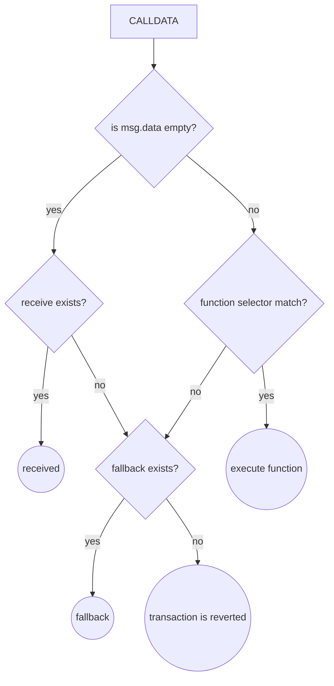

[Solidity Smart contracts](https://sergiomartinrubio.com/articles/getting-started-with-solidity/) have two built in fallback functions that are triggered when no other function in the contract matches the specified function in the call. This can happen for multiple reasons like a type, the use of [Smart Contract Proxies](https://sergiomartinrubio.com/articles/how-to-release-a-new-versions-of-smart-contracts/) or for [Re-Entrancy](https://solidity-by-example.org/hacks/re-entrancy/) attacks.

There are two fallback functions:
* `received()`
* `fallback()`



## receive()

- This is also an unnamed external payable function without any input or output parameters. 
- This function is executed when the smart contract is called with ether but no `calldata` is provided.
- If there is no `receive()` function, then the `fallback()` is executed (and if there is no receive nor fallback, then the transaction reverts).

In the example below `receive()` is executed when we invoke the `CALLDATA` function without any argument.

```solidity
// SPDX-License-Identifier: MIT

pragma solidity ^0.8.7;

contract FallbackReceive {

    uint256 private value;

    receive() external payable {
        value += 1;
    }

    function getValue() public view returns(uint256) {
        return value;
    }
}
```

However, if we pass a hexadecimal value (e.g. `000A`) to `CALLDATA` it will fail because it requires `fallback()`.

## fallback()

- This is an unnamed external function without any input or output parameters. 
- This function is executed when no other functions match the intended function calls and calldata is sent.
- If ETH are sent to smart contracts with calldata's and the function selector doesn't match any existing function in the contract, the fallback() function is executed (again, if no fallback is implemented, the transaction reverts).

In the example below `fallback()` is executed when we invoke the `CALLDATA` function with (e.g. `000A`) and without arguments.

```solidity
// SPDX-License-Identifier: MIT

pragma solidity ^0.8.7;

contract FallbackReceive {

    uint256 private value;

    fallback() external payable {
        value += 2;
    }

    function getValue() public view returns(uint256) {
        return value;
    }
}
```
