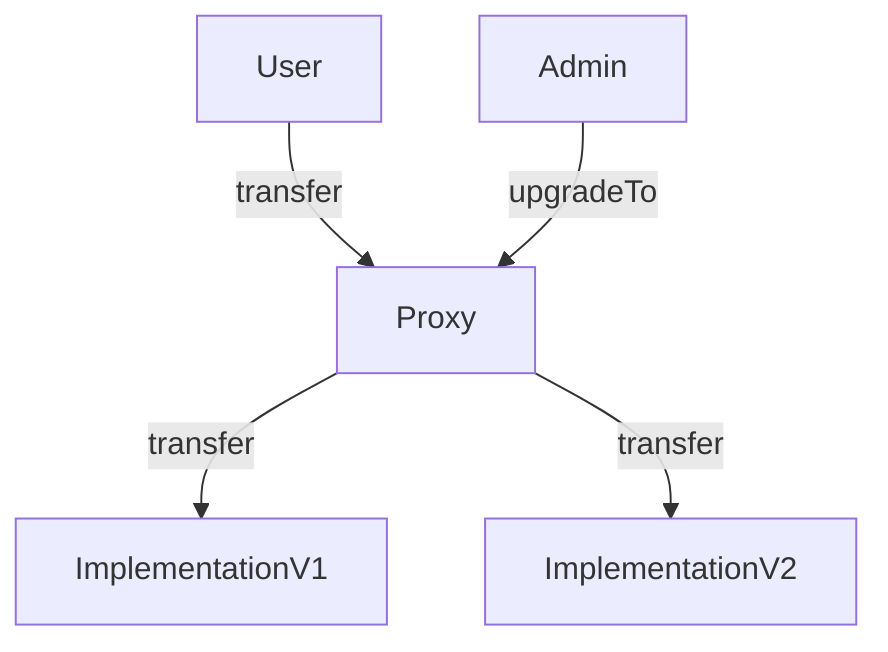

First of all, [smart contracts](https://sergiomartinrubio.com/articles/getting-started-with-solidity/) are immutable, once a smart contract is deployed there is no way of making modifications on the smart contract logic, and this is great news because nobody can tamper your code. However, there are scenarios where you want to upgrade your smart contract for adding new features or fixing bugs. Even though smart contracts are immutable there are some workarounds for deploying a new version of your smart contract.

Three different ways of releasing a new version of your smart contract:

a. **Parameterization**
b. **Social migration**
c. **Proxies**

## Parameterization

This strategy is based on using storage variables that allow the to tweak the behavior of the smart contract. This method is not really releasing a new version of your smart contract since you are just changing the parameter values and the logic stays as it is.

The main advantage of this strategy is that is very simple to implement, but on the flip side it's not very future proof because you might not know what new functionality you will require in the future. Another drawback it's the fact that most likely a single admin person can modify the parameters, and this means your smart contract is less decentralized.

## Social Migration

This strategy consist of asking people to start using the new version of the smart contract. This method ensures a higher degree of decentralization since it's up to the people to decide what version of the contract they want to use. However, there is a big disadvantage which is the fact that a new smart contract address must be use and you need to somehow reach out everyone to start using the new address. Another pain point is moving the state, like balances, from the old to the new smart contract, specially because it might require a lot of work. You can find more details about how to migrate the data from one smart contract to another on ["How contract migration works - Flash Sheridan" article](https://blog.trailofbits.com/2018/10/29/how-contract-migration-works/){:target="_blank"}.

## Proxies

Proxies allow you to change the behavior of your smart contract without people noticing that they are using a new implementation. Proxies are based on the use one of the [Solidity call functions](https://sergiomartinrubio.com/articles/interact-with-a-solidity-smart-contract-via-econded-data/), the `address.delegatecall(bytes)` function, which invokes the logic from the callee smart contract and updates the state on the caller contract.

The `delegatecall` function in combination with the `fallback` function allows you route all the proxy smart contract invocations to some other contracts. This means that you can have a single proxy contract with the same address forever and just routes calls to one of the implementation contracts. Releasing a new version is a matter of deploying a new contract and updating the implementation contract address.



- The implementation contract has the actual logic that you want users to execute.

- The proxy contract is simple a smart contract that routes calls to a particular implementation contract and where storage variables values are saved. The address of the proxy contract is what users will use and will never change.

Again, one of the disadvantages of this strategy is that an admin user must have access to an "upgrade" function to point to new versions of the contract, so you have a single centralized point of failure and as a result the contract is not fully decentralized.

> Using proxy patterns correctly and securely is difficult and risky, so it requires deep knowledge of the proxy pattern, Solidity, and the EVM.

### A Minimalist Proxy

[OpenZeppelin](https://www.openzeppelin.com){:target="_blank"} provides a abstract [base Proxy contract that implements the core delegation functionality](https://github.com/OpenZeppelin/openzeppelin-contracts/blob/master/contracts/proxy/Proxy.sol){:target="_blank"}, and we will use it to build a minimalist *transparent proxy*.

1. First of all, our proxy will inherit from the OpenZeppelin `Proxy` abstract contract.
2. Store in `_IMPLEMENTATION_SLOT` the storage slot location of the implementation contract address. To avoid clashes in storage usage between the proxy and implementation contract, the address of the implementation contract is saved in a specific storage slot guaranteed to be never allocated by a compiler. *OpenZeppelin* uses  `0x360894a13ba1a3210667c828492db98dca3e2076cc3735a920a3ca505d382bbc`, so let's use it too.
3. Create a `upgradeTo(address)` function for setting the implementation contract address.
4. Override `_implementation()` for fetching the address of the implementation contract.
5. Create a function for encoding the implementation function signature: `getEncodedFunctionSignature(uint256)`. We will pass the encoded function selector to `CALLDATA`. 
6. Create a function for fetching the value we are setting on the storage slot index zero (`sload(0)`): `readStorage()`. We don't even need to declare the storage variable in the proxy contract.

```solidity
// SPDX-License-Identifier: MIT

pragma solidity ^0.8.7;

import "@openzeppelin/contracts/proxy/Proxy.sol";

contract MyProxy is Proxy {
    bytes32 private constant _IMPLEMENTATION_SLOT = 0x360894a13ba1a3210667c828492db98dca3e2076cc3735a920a3ca505d382bbc;

    function upgradeTo(address newImplementation) public {
        assembly {
            sstore(_IMPLEMENTATION_SLOT, newImplementation)
        }
    }

    function _implementation() internal view override returns (address implementationAddress) {
        assembly {
            implementationAddress := sload(_IMPLEMENTATION_SLOT)
        }
    }

    function getEncodedFunctionSignature(uint256 _value) public pure returns(bytes memory) {
        return abi.encodeWithSignature("setValue(uint256)", _value);
    }

    function readStorage() public view returns(uint256 valueAtStorageSlotZero) {
        assembly {
            valueAtStorageSlotZero := sload(0)
        }
    } 
}

contract V1 {
    uint256 public value;

    function setValue(uint256 _value) public {
        value = _value;
    }
}

contract V2 {
    uint256 public value;

    function setValue(uint256 _value) public {
        value = _value + 1;
    }
}
```

Here we are using [Solidity assembly code](https://docs.soliditylang.org/en/v0.8.14/assembly.html){:target="_blank"}, which is not recommended in most of the cases because it's easier to introduce security vulnerabilities.

> Please do not use this proxy contract in production since we are not even restricting the access to the update function to admin users.

Now, let's take a look at the *OpenZeppelin* `Proxy` abstract contract. Basically this is what happens when the `DELEGATECALL` is invoked with the implementation encoded selector functions:

1. We invoke `CALLDATA` with the encoded selector function (i.e. `10` -> `0x55241077000000000000000000000000000000000000000000000000000000000000000a`) as argument.
2. The [fallback](https://sergiomartinrubio.com/articles/solidity-fallback-and-receive-functions/) function is triggered since there is no function in the proxy contract that matches the encoded selector signature.
3. The [fallback](https://sergiomartinrubio.com/articles/solidity-fallback-and-receive-functions/) invokes `_fallback` and the former invokes `_delegate(_implementation())`. Given that `_implementation()` was overridden on our Proxy contract implementation, it should return the implementation smart contract address.
4. Now `_delegate(address)` executes some assembly functions and the `delegatecall` function with the provided implementation smart contract address.

```solidity
// SPDX-License-Identifier: MIT
// OpenZeppelin Contracts (last updated v4.6.0) (proxy/Proxy.sol)

pragma solidity ^0.8.0;

abstract contract Proxy {
    function _delegate(address implementation) internal virtual {
        assembly {
            calldatacopy(0, 0, calldatasize())

            let result := delegatecall(gas(), implementation, 0, calldatasize(), 0, 0)

            returndatacopy(0, 0, returndatasize())

            switch result
            case 0 {
                revert(0, returndatasize())
            }
            default {
                return(0, returndatasize())
            }
        }
    }

    function _implementation() internal view virtual returns (address);

    function _fallback() internal virtual {
        // other stuff
        _delegate(_implementation());
    }

    fallback() external payable virtual {
        _fallback();
    }

    // other stuff
}
```

### Proxy Contracts Issues

a. **Storage clashes**: you can only append storage variables into new implementations since storage variables are indexed, so if you change the order of one of the storage variables in the new implementation you would store the value in the wrong variable. 
b. **Signature selector clashes**: this happens when the proxy contract has a function with the same selector as one of the functions in the implementation.

```solidity
contract V2 {
    uint256 public value;

    function setValue(uint256 _value) public {
        value = _value + 1;
    }

    // this function can't never be called 
    // because the Proxy contract has a function upgradeTo(address)
    function upgradeTo() {

    }
}
```

There are proxy patterns that can get around the storage and signature selector clashes:

a. **Transparent Proxy Pattern**
b. **Universal Upgradeable Proxy Pattern**

### Transparent Proxy Pattern

*OpenZeppelin* provide a solution to the function clashes and it's via the *transparent proxy pattern*.

The transparent proxy will route the calls to the management functions or the contract implementation based on the caller address:

* Admins can only call management functions and the proxy will not delegate any of those calls.
* If the caller is a non admin user, the proxy will always delegate the call to the implementation contract.

You can use the [TransparentUpgradeableProxy](https://github.com/OpenZeppelin/openzeppelin-contracts/blob/master/contracts/proxy/transparent/TransparentUpgradeableProxy.sol){:target="_blank"} contract.

### Universal Upgradeable Proxy Pattern

The different between the *Transparent Proxy Pattern* and the *Universal Upgradable Proxy* pattern, is that the latter has the logic logic for upgrading the contract in the implementation contract, it will contain both, the contract’s logic and all the code necessary to update the implementation’s address that is stored at a specific slot in the proxy’s storage space.

The OpenZeppelin implementation of UUPS is the [UUPSUpgradeable](https://github.com/OpenZeppelin/openzeppelin-contracts/blob/master/contracts/proxy/utils/UUPSUpgradeable.sol){:target="_blank"}.

The trend is to use the *UUPS* (Universal Upgradeable Proxies) instead of the *Transparent Proxy Pattern*, because the *UUPS* is more lightweight and versatile.

The downside of this pattern is that you cannot forget to add the upgrade logic on the implementation contract.

## Conclusion

Upgrading a smart contract feels like an anti-pattern, because it goes against one of the principles of smart contracts - decentralization - and the existing strategies are quite hacky. The [Contract upgrade anti-patterns article](https://blog.trailofbits.com/2018/09/05/contract-upgrade-anti-patterns/){:target="_blank"} describes in detail the problems about the different strategies. Therefore, only release new versions of your smart contract when it's strictly necessary and follow the best strategy that fits your use case.
